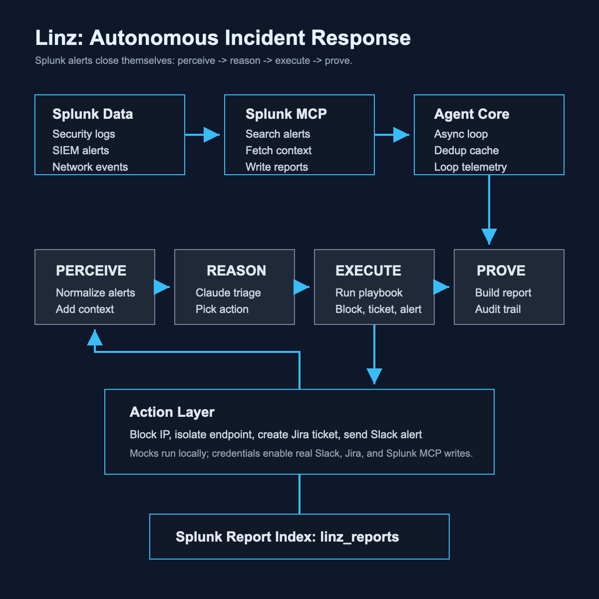

# Linz

> Autonomous incident response agent for Splunk.
> Detects -> reasons -> acts -> reports. No human in the loop.

Linz turns Splunk security alerts into closed incidents. It polls Splunk through a Splunk MCP client, asks an AI triage agent to classify the threat and choose a response, executes a playbook, then writes a full audit report back to Splunk.

## Hackathon Fit

Built for the Splunk Agentic Ops Hackathon, Security track, with a bonus target for Best Use of Splunk MCP Server. Linz is not a dashboard or chatbot: it closes the incident response loop.

## Architecture



## Quick Start

```bash
python -m venv .venv
source .venv/bin/activate
pip install -r requirements.txt
cp .env.example .env
```

Run the local end-to-end demo:

```bash
python demo/attack_simulator.py --scenario ssh_bruteforce
python -m agent.orchestrator --once
```

Run all three demo scenarios:

```bash
python demo/attack_simulator.py --scenario all
python -m agent.orchestrator --once
```

The demo writes queue and report files to `.linz_demo/`, mirroring the Splunk data flow while your Splunk Enterprise and MCP Server setup is being configured.

## Real Integrations

Set these values in `.env`:

- `SPLUNK_MCP_URL` and `SPLUNK_TOKEN` for Splunk MCP Server reads/writes
- `ANTHROPIC_API_KEY` and `LINZ_USE_MOCK_AI=false` for Claude Sonnet triage
- `SLACK_WEBHOOK_URL` for real Slack notifications
- `JIRA_BASE_URL`, `JIRA_EMAIL`, `JIRA_API_TOKEN`, and `JIRA_PROJECT_KEY` for Jira ticket creation

## Demo Script

The full recording script is in [demo/demo_script.md](demo/demo_script.md). Keep the final video under 3 minutes and show:

- attack event injection
- `[PERCEIVE]`, `[REASON]`, `[EXECUTE]`, and `[PROVE]` logs
- the report written back to the report index
- the architecture diagram

## Project Structure

```text
agent/       perceive, reason, execute, prove, orchestrate
splunk/      MCP client, alert polling, report writing
playbooks/   response actions
prompts/     Claude triage and report prompts
demo/        attack simulator and video script
tests/       fixtures and unit tests
```

## License

MIT
